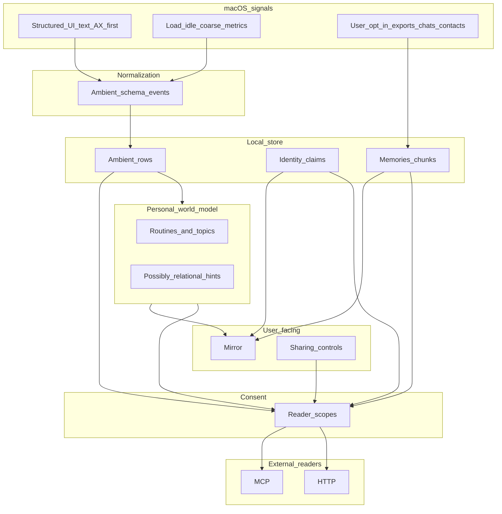

# Ambient memory platform roadmap

**Canonical in git.** This is the version-tracked product roadmap. An older editable twin lived under Cursor Plans (`repo_state_and_roadmap_a97360f4`); treat **this file** as source of truth when priorities change.

**Overview:** Local-first vault with mirror + selective sharing — ambient sensing (text-first), temporal **belief plasticity** (opinions change; supersession & decay), **remember/compress/forget** policy, tiered storage so large histories stay reachable but light, consent engine, scoped retrieval, Claude extensions under reader scopes.

**Workstreams** (track implementation progress in PRs; shrink or extend rows as shipped):

| Theme               | Intent                                                                                                                    |
| ------------------- | ------------------------------------------------------------------------------------------------------------------------- |
| Mirror & self-view  | Time-aware “who you are”; identity + clusters + motifs with provenance (`desktop/`, `identity.build_identity_summary`).   |
| Sharing & consent   | Per-reader scopes; enforce in MCP + HTTP; default deny sensitive strata (`consent_policy.py`, `mcp_server.py`, `api.py`). |
| Identity lockdown   | Token, audit, sensitive paths under consent (`identity.py`, `mcp_server.py`).                                             |
| World model (macOS) | Text-first sensing palette; sparse OCR/raster; coarse proxies (`desktop/src-tauri/`, `AGENTS.md`).                        |
| Trust & lifecycle   | Corrections, retention/decay, negative capability, adversarial MCP posture.                                               |
| Belief plasticity   | Supersession, validity intervals, user vs inferred updates.                                                               |
| Ambient model       | Unified event schema + ingest defaults (`chatgpt_mcp_memory`).                                                            |
| Search fast & fresh | Scoped retrieval; freshness via **storage_tier sort epsilon** + identity rerank; **`GET /today` butler bundle** |
| Compression tiers   | Hot/warm/cold, compaction, distillation (`store.py`, `POST /maintenance/storage-tier-promote-stale`, Status UI).          |
| Second brain UI     | Route shell: Today / Mirror / Wiki / Work / Sources — see [`docs/SECOND_BRAIN.md`](SECOND_BRAIN.md).                         |
| Claude extensions   | Bounded readers; docs for exposure tiers (`EXTENSIONS_AND_SCOPES.md`).                                                    |

---

# Roadmap: mirror, vault, selective sharing — personal world model on macOS

Prior **repo housekeeping** stays **archived** unless it blocks this spine.

---

## What this means for the user

People spend **many hours on-screen**. Minion should make that legible without voyeurism:

1. **See yourself clearly** — Mirror combines explicit identity material **plus patterns of attention**: where time tends to go, what contexts repeat, what projects drag — surfaced as **interpretive summaries with receipts**, not black-box psychology.
2. **Hold a vault** — **Text-derived traces** (structured UI strings, titles, AX excerpts) are still sensitive but lighter than pixel streams; **screenshots/rasters stay exceptional** — gated, sparse, or user-triggered. Coarse telemetry stays **private-first** until aggregated summaries promote outward sharing.
3. **Choose what others may read** — Same consent grid applies to **files AND modeled-you**: Claude might see approved identity bullets plus opt-in summaries built from **read-text aggregates**, not continuous frame grabs unless you grant an extreme capture scope.
4. **Readable or not** — External entities receive scoped projections (critical summaries, redacted chunks, synthetic narratives built only from allowed strata).

Product promise: **We show you who you are from what we know — including how your Mac-visible life fits together — and you decide what anyone else gets to read.**

---

## Personal world model (design intent)

A **personal world model** is **not** a generic corpus embed — it is **structured beliefs about this user’s situation**.

**Capture-first on the Mac:** structured Accessibility text + browser page text + **per-window screenshots + inbox OCR** when AX is empty (settings-driven, vault-local). Deny lists skip credential UIs by default.

| Signal families              | Examples                                                                                                                                                                                                 | Role                                                                 |
| ---------------------------- | -------------------------------------------------------------------------------------------------------------------------------------------------------------------------------------------------------- | -------------------------------------------------------------------- |
| **Desk capture (steady state)** | Focus + all visible windows; `ax_nodes` fingerprints; browser `innerText`; region `screencapture` → rapidocr when AX thin; mic when enabled — consolidated into `ambient-summary` hourly | Ground truth for “what was attention on?” on the machine you use |
| **macOS-visible proxies**             | Coarse CPU / idle-active patterns / thermal-energy-ish rhythms where APIs permit ethical aggregates — **not** fantasizing keystrokes — useful as attention/load proxies (“heavy afternoons”)                                                                       | Correlate effort bursts vs downtime                                                       |
| **Behavioral motifs**                 | Recurring workflows, topic recurrence across captures (coding vs messaging vs browsing contexts—differentiated carefully), naming inferred routines without pretending omniscience                                                                                 | Mirror timeline + boosts retrieval ranking privately                                      |

Relational hints (**people you talk to often**) ship **only** when grounded in **permitted sources** (exported chats ingested by choice, mail/contact-derived summaries user opted into, etc.). Planning assumes sandbox/App Review realities — **no background scraping** where Apple forbids it without consent UX.

**Consent-critical defaults**: ambient/world-model strata ship **vault-local + aggregated summaries** to Mirror UI before anything crosses MCP/HTTP.

---

## Temporal beliefs — opinions change (brain-like rewriting)

People **update what they believe**. Software tends to snapshot identity as frozen facts; that fights reality.

**Design stance:**

1. **Versioned truth** — Active claims are **current**; history stays inspectable (who superseded whom, when). Align with existing PATCH semantics (`superseded_by`, merged `meta`) rather than silent overwrite.
2. **Sources of change** — **User-authored** (explicit edit/reject in Mirror) vs **model-proposed** (cluster drift, new evidence) vs **ambient-correlated** (behavior shifts). Each writes different audit metadata so the mirror can say *you changed this* vs *we inferred this*.
3. **Plasticity metaphor** — Retrieval **without shame**: surfacing an old belief alongside contradictory evidence is closer to **reconsolidation** than “the DB lied.” UX: offer merge, supersede, or “still true in context X.”
4. **Stale ≠ false** — Time-decay lowers **confidence** or visibility for unread motifs; it does not silently delete user-approved identity unless policy says so.

---

## Remember vs compress vs forget

Borrow brain metaphors **lightly** — implementation stays deterministic and auditable.

| Tier                    | Intent                                                                                                                                                                      | Examples                                                              |
| ----------------------- | --------------------------------------------------------------------------------------------------------------------------------------------------------------------------- | --------------------------------------------------------------------- |
| **Keep verbatim**       | Pin **high-salience** evidence — user-starred, legally sensitive you freeze, identity claims user approved, rare irreplaceable captures                                     | Always searchable at chunk/grain                                      |
| **Summarize + pointer** | **Consolidation** — episodic ambient tails and repetitive captures roll into rolling summaries that retain links to sample provenance chunks                                | Mirror reads summaries first; drill-down loads evidence               |
| **Aggressive compress** | Lossy but reversible envelope — older OCR blobs, redundant AX snapshots after motif extracted                                                                               | Byte shrink; metadata preserves “something happened here”             |
| **Forget / purge**      | True deletion or beyond-retrieval — **policy-bound** (TTL per modality), user wipe-one-stratum, or dedupe collapse (`AGENTS.md` fingerprint philosophy extended to ambient) | Audit row optional (“ghost index”: date range retained, content gone) |

**Signals for automation** (defaults conservative): recency, **reuse count at query time**, task linkage (“project active”), user pins, modality noise score (ambient chatter vs imported docs).

---

## Huge histories, light machine — accessibility without bloat

Goal: **multi-year corpus feels instant**, stays mostly **on one SSD**.

| Lever                             | Role                                                                                                                                               |
| --------------------------------- | -------------------------------------------------------------------------------------------------------------------------------------------------- |
| **Tiered storage**                | Hot SQLite working set + warm summarized strata + cold offload path (second volume / sparse files) with **lazy hydrate** when search hits cold IDs |
| **Summaries as first-class rows** | Distilled nodes participate directly in semantic + keyword retrieval so queries rarely pull thousands of raw ambient rows                          |
| **Dedup & near-dup collapse**     | Extend fingerprint-style collapse (`AGENTS.md`) across repetitive AX captures                                                                      |
| **Embedding / index economics**   | Quantization or narrower dims only after regression harness says recall holds; batch internal_k sanely                                             |
| **Scope-aware indexes**           | Reader scopes shrink candidate sets — fewer vectors touched per MCP query                                                                          |
| **Compaction jobs**               | Background passes merge tails, vacuum strategic pages, rotate telemetry — **never block search latency spiky**                                     |

---

## Ambient signal inventory (Mac / laptop)

Treat everything below as **candidate inputs** — each row needs **schema typing**, **default tier**, **retention**, and **UI toggle**. Many require **entitlements** or are **export-only** because sandbox forbids silent access.

### Already aligned with plan

| Bucket                         | Examples                                                                                                                                               | Notes                                                                                |
| ------------------------------ | ------------------------------------------------------------------------------------------------------------------------------------------------------ | ------------------------------------------------------------------------------------ |
| **Foreground / attention**     | Frontmost app bundle ID / name; window title where OS exposes it without AX                                                                            | Cheap substitute for “what tab of life am I in?” — titles vary in sensitivity        |
| **Structured UI text**         | Accessibility tree excerpts + `ax_nodes`, browser page text                                                                                            | Primary capture modality                                                             |
| **Hardware / load proxies**    | Aggregate CPU busy % (interval), memory pressure events (coarse), thermal state (`nominal`/`fair`/`serious`/`critical`), disk space low-water warnings | Rough correlates of heavy work vs idle — **not** per-process surveillance by default |
| **Power / mobility**           | AC vs battery, charge % (coarse), Low Power Mode flag                                                                                                  | Shapes honest cadence (“lighter sampling on battery”)                                |
| **Time / locale**              | Local TZ, calendar day boundaries                                                                                                                      | Grounds routines without cloud calendar                                              |
| **Displays**                   | Screen count, approximate desktop arrangement changes                                                                                                  | Coarse context switch (dock vs desk)                                                 |
| **File imports**               | Inbox watcher for user-dropped exports                                                                                                                  | Optional supplement — desk capture is primary                                      |
| **Audio**                      | **Mic listening sessions** (`listening_*` → faster-whisper → `ambient-audio` chunks)                                                                  | Explicit start/stop in Settings — no background mic without session                 |
| **Unified ambient stream**     | `ambient/stream.jsonl` + `GET /attention/summary` + per-collector toggles in Settings                                                                  | Shipped in desktop + sidecar; see `docs/LIFE_GRAPH.md`                               |
| **Screen reader (all windows)** | `window_snapshot` via `screen_reader.rs` (event-triggered + ~5s poll, AX + OCR fallback, 12 windows/tick)                                             | Shipped                                                                              |

### Strong opt-in (usually entitlement + prompt)

| Bucket                              | Examples                                                                                         | Notes                                                                                                                            |
| ----------------------------------- | ------------------------------------------------------------------------------------------------ | -------------------------------------------------------------------------------------------------------------------------------- |
| **Calendars**                       | EventKit — upcoming density, recurring patterns (not raw invite bodies by default unless scoped) | Huge for “life rhythm” if user permits                                                                                           |
| **Contacts / identity graph hints** | CNContactStore — labeled relationships you already store                                         | Never imply messaging content without separate consent                                                                           |
| **Reminders / structured lists**    | Same-store APIs or user-exported ICS/markdown into inbox                                         | Prefer explicit exports when API churn hurts                                                                                     |
| **Location-ish network**            | Current Wi‑Fi SSID (often reads as “home vs café”)                                               | Treat as **location proxy** — gated; never ship to MCP default                                                                   |
| **Clipboard**                       | Recent pasteboard snippets                                                                       | **Danger tier** — passwords/secrets magnet; off unless manicured scope + short TTL + exclude known secret patterns heuristically |

### Optional file imports

User-dropped exports (chat backups, mail mbox, bookmarks) supplement desk capture — no OAuth connector ring as the product story.

### OS / lifecycle hooks (often notification-based)

| Bucket                          | Examples                                                         | Notes                                                  |
| ------------------------------- | ---------------------------------------------------------------- | ------------------------------------------------------ |
| **Sleep / wake / session**      | Workspace notifications (`NSWorkspace`), screensaver/lock coarse | Separates “at desk” vs away without webcam             |
| **Fast user switching / login** | Session boundaries                                               | Multi-user honesty — avoid merging two people’s worlds |
| **Updates / installs**          | Sparkle-style signals less relevant; installer prompts coarse    | Low priority                                           |
| **Printing / sharing sheet**    | Rare — optional future                                           | Edge modality                                          |

### Explicit non-goals by default (negative capability)

- Raw **global keystroke** logging, **password-field** AX traversal, unrestricted **clipboard**, silent **keychain**, **Screen Time private API** scraping, or **other apps’ sandboxed data** without Apple-supported routes — document as **refused** unless future compliant API appears.

---

## What makes the plan “great,” not just ambitious

| Gap                                   | Why it matters                                                                                                          |
| ------------------------------------- | ----------------------------------------------------------------------------------------------------------------------- |
| **Temporal beliefs / supersession**   | Mirror reflects **changing minds**, not orphan snapshots — aligns UX + schema (`belief-plasticity`)                     |
| **Correction + contradiction**        | One-gesture “false” updates posteriors and audit trail; feeds supersession, not silent deletes (`trust-loop-lifecycle`) |
| **Consolidation + forgetting policy** | What promotes to summary vs decays vs purges — auditable automation (`remember/compress/forget` §)                      |
| **Cold tier + lazy hydrate**          | Keeps laptop light without sacrificing “I know it’s in here somewhere” (`compression-tier`)                             |
| **Retention/decay per modality**      | AX snippets stale fast; calendar patterns need longer memory — one TTL invites distrust                                 |
| **Explainability drill-down**         | Every mirror headline links to **supporting events** the user can inspect or delete                                     |
| **Sampling ethics**                   | Back off on battery/LPM; burst only after explicit user action                                                          |
| **Adversarial MCP**                   | Combine tools / prompts cannot exfiltrate strata user withheld                                                          |
| **Negative capability doc**           | Marketing + Settings honesty beats hidden creep                                                                         |
| **Work vs personal separation**       | Future: separate vault namespaces or profiles once ambient volumes grow                                                 |

---

## North-star outcomes (technical themes)

1. Mirror + synthesis UX — claims → motifs → narrative tiers, always **time-aware** (**current stance + revision history**, no silent overwrite).
2. Consent-first exposure matrix (+ ambient strata defaults deny-export).
3. Identity lockdown + audit under scopes.
4. **Personal world model + temporal beliefs** — ambient aggregates **and** plastic identity graph (supersession, provenance of change).
5. Fast/fresh scoped search.
6. **Tiered compaction + cold paths** — huge corpora stay reachable via summaries-first retrieval, lazy hydrate, policy-driven distill — after semantics stabilize (`compression-tier`).
7. Claude/extensions bounded readers — document tiers (**text aggregates vs OCR snippets vs pixel evidence**) so extensions cannot widen capture silently.

---

## Existing codebase anchors

| Theme                    | Where it lives                                           |
| ------------------------ | -------------------------------------------------------- |
| Retrieval / MCP          | `chatgpt_mcp_memory/src/mcp_server.py`, `AGENTS.md`      |
| HTTP auth                | `chatgpt_mcp_memory/src/api.py`                          |
| Identity / summaries     | `chatgpt_mcp_memory/src/identity.py`                     |
| Desktop UI               | `desktop/`                                               |
| First-party capture note | `AGENTS.md` (screen/audio; deliberate expansion surface) |
| Rust capture hooks       | `desktop/src-tauri/`                                     |

---

## Architecture

---

## Phasing (suggested)

1. **Sharing consent + vault-default strata** — Must precede scaling ambient ingestion.
2. **Mirror MVP + belief plasticity** — Claims/clusters with **current vs history** stance; wire supersession / revision semantics early so ambient motifs don’t fight identity debt later.
3. **World-model palette** — Implement mac sensing primitives behind toggles; land normalization schema (`ambient-model`) concurrently.
4. **Aggregation → Mirror** — Ship summaries from desk capture + consolidation (`ambient-summary`); MCP export stays consent-gated.
5. Identity lockdown + scoped fast search → **tiered compaction / cold paths** (`compression-tier`) → extensions docs.

---

## Clarifications during execution

- **Framework ordering**: Accessibility + browser text first; per-window `screencapture` + rapidocr when AX is empty (settings `capture_on_empty_ax`); ScreenCaptureKit only if we need full-display video later.
- Exact Apple APIs per modality chosen during spikes against entitlement/App Review posture.
- **Keystrokes/content inference**: default avoids capturing keystroke payloads; prefer structured UI/app attribution unless explicit risky opt-in is modeled separately.
- **Clipboard / pasteboard**: **danger-tier only** — default off; short TTL if ever enabled; never default-export to readers.
- People/contact linkage constrained by consent + platform APIs — planning acknowledges Messages sandbox friction upfront.

---

## Archived backlog

- Desktop README vs bundle drift.
- Playwright E2E in CI.
